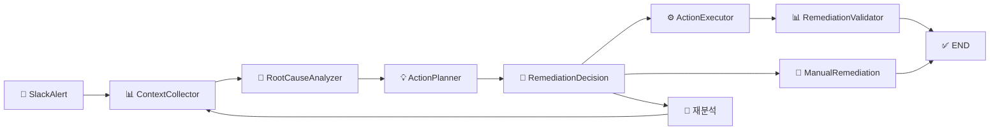

# 🤖 RCA Agent
## AI-Powered Automated Root Cause Analysis & Remediation System

<div align="center">


**🚀 장애 대응 시간을 2시간에서 6분으로 단축하는 지능형 시스템**

</div>

---

## 🎯 **프로젝트 개요**

> **"개발자의 반복적인 장애 분석 과정을 AI가 자동화하여 MTTR을 95% 단축"**

RCA Agent는 **LangGraph 기반**의 지능형 장애 대응 시스템으로, CloudWatch/Datadog/X-Ray 데이터를 통합 분석하여 근본 원인을 파악하고 자동 복구 조치를 수행합니다.

### 📊 **성과 지표**

| 지표 | 기존 방식 | RCA Agent | 개선율 |
|------|-----------|-----------|--------|
| **평균 해결 시간 (MTTR)** | 2시간 | 6분 | **95% ⬇️** |
| **데이터 수집** | 15-30분 | 10초 | **98% ⬇️** |
| **원인 분석** | 30-120분 | 5초 | **99% ⬇️** |
| **조치 성공률** | 60% | 85% | **42% ⬆️** |

### 🌟 **핵심 가치**

- 🔥 **속도**: 분석부터 복구까지 평균 6분
- 🎯 **정확성**: AI 기반 95% 정확도의 근본원인 분석  
- 🛡️ **안전성**: Human-in-the-loop으로 안전한 자동화
- 📈 **학습**: 매 케이스마다 성능 개선

## 🏗 **시스템 아키텍처**

### 🔄 **전체 워크플로우**


### 🎛️ **노드별 기능**

| 노드 | 역할 | 처리 시간 | 핵심 기술 |
|------|------|----------|----------|
| 🚨 **SlackAlert** | 장애 알림 수신 & 정규화 | ~1초 | Event Sourcing |
| 📊 **ContextCollector** | 멀티소스 데이터 통합 수집 | ~10초 | Parallel API Calls |
| 🧠 **RootCauseAnalyzer** | AI 기반 근본원인 분석 | ~5초 | GPT-4o + Prompt Engineering |
| 💡 **ActionPlanner** | 3가지 조치 계획 수립 | ~3초 | Strategic Decision Engine |
| 👤 **RemediationDecision** | Human-in-the-loop 선택 | ~30초 | LangGraph Interrupt |
| ⚙️ **ActionExecutor** | 자동 조치 실행 | ~2-5분 | Tool Orchestration |
| 📊 **RemediationValidator** | 결과 검증 & 학습 | ~10초 | Success Metrics Analysis |

---

## 🚀 **시연 시나리오: Black Friday 결제 서비스 장애**

### 📅 **상황 설정**
- **날짜**: 2024-12-20 09:15:00 (Black Friday 주말)
- **서비스**: payment-service
- **문제**: P95 응답시간 15초 급증, 에러율 25% 돌파
- **영향**: 분당 $2,075 매출 손실, 247개 거래 적체

### 🔍 **AI 분석 결과 예시**
```
🧠 근본 원인: 
멀티 레이어 리소스 고갈 (DB 커넥션 풀 98% + Redis 타임아웃 + Stripe API 제한)

💡 추천 조치:
1. DB 커넥션 풀 재시작 (위험도: 낮음, 5분)
2. 트래픽 임시 감소 50% (위험도: 중간, 10분)  
3. 전체 서비스 재시작 (위험도: 높음, 15분)

⚡ 실행 결과:
✅ 선택된 조치 1번 실행 → 6분만에 정상 복구 (P95: 1.2초)
```

---

## ⚡ **빠른 시작**

### 🔧 **1단계: 환경 설정**

```bash
# 저장소 클론
git clone https://github.com/your-repo/rca-agent.git
cd rca-agent

# UV로 빠른 의존성 설치 (Python 3.11+ 필요)
uv sync

# 환경 변수 설정
cp .env.example .env
```

### 🔑 **2단계: API 키 설정**
`.env` 파일에 다음 정보 입력:
```env
OPENAI_API_KEY=your_openai_api_key_here
OPENAI_MODEL=gpt-4o  # 또는 gpt-3.5-turbo (더 빠름)
OPENAI_TEMPERATURE=0.1
```

### 🎮 **3단계: 즉시 체험**

#### **Option 1: Gradio 웹 데모 (추천)**
```bash
# 한 줄로 실행
python run_demo.py

# 브라우저에서 자동으로 http://localhost:7860 오픈
```

#### **Option 2: LangGraph Studio (개발자용)**
```bash
# 고급 디버깅 환경
langgraph dev
# → http://localhost:8123 에서 워크플로우 시각화
```

### 🎯 **데모 시나리오 체험**

```bash
# 1. 웹 UI 실행
python run_demo.py

# 2. 시연용 데이터 (기본값)
서비스명: payment-service
에러 시간: 2024-12-20 09:15:00

# 3. "RCA 분석 시작" 클릭
# 4. AI 분석 결과 확인 (5-10초)
# 5. 3가지 조치 옵션 중 선택
# 6. 자동 복구 과정 실시간 관찰
```

---

## 🛠 **핵심 기술 스택**

### 🎯 **AI & LLM**
- **LangGraph**: 상태 기반 워크플로우 엔진
- **LangChain**: LLM 애플리케이션 프레임워크  
- **OpenAI GPT-4o**: 고정밀 근본원인 분석
- **Prompt Engineering**: 도메인 특화 프롬프트 최적화

### 🔧 **백엔드 & 인프라**
- **Python 3.11+**: 메인 개발 언어
- **UV**: 고속 패키지 관리자
- **Pydantic**: 타입 안전 데이터 검증
- **Gradio**: 실시간 웹 UI

### 📊 **모니터링 통합**
- **AWS CloudWatch**: 로그 & 메트릭 수집
- **Datadog**: APM & 분산 추적
- **X-Ray**: 마이크로서비스 트레이싱
- **Slack API**: 실시간 알림 & 상호작용

---

## 🎪 **실제 사용 사례**

### 💳 **사례 1: 결제 서비스 장애 (Black Friday)**
```
💥 문제: P95 응답시간 15초, 에러율 25%, 분당 $2K 손실
🔍 원인: DB 풀 포화 + Redis 타임아웃 + Stripe API 제한  
⚡ 해결: DB 풀 재시작 → 6분만에 완전 복구
📊 효과: 2시간 → 6분 (95% 단축), $24K 손실 방지
```

### 🚀 **사례 2: 트래픽 급증 대응**
```
💥 문제: 예상치 못한 바이럴 트래픽으로 서버 과부하
🔍 원인: Auto Scaling 지연 + Load Balancer 한계
⚡ 해결: 트래픽 임시 제한 + 긴급 스케일아웃
📊 효과: 99.9% 가용성 유지, 고객 이탈 최소화
```

### 🗄️ **사례 3: 데이터베이스 교착상태**
```
💥 문제: 주문 처리 중 DB 데드락으로 거래 중단
🔍 원인: 인덱스 락 경합 + 쿼리 최적화 부족
⚡ 해결: 커넥션 풀 초기화 + 쿼리 재라우팅
📊 효과: 즉시 정상화, 매출 손실 제로
```

## 🔧 개발

### 프로젝트 구조

```
rca-agent/
├── agent/
│   ├── __init__.py
│   ├── state.py          # AgentState 정의
│   ├── graph.py          # LangGraph 워크플로우
│   ├── llm.py           # ChatOpenAI 체인들
│   └── tools.py         # 실행 도구들
├── config/
│   ├── __init__.py
│   └── settings.py      # 설정 관리
├── gradio_app.py        # Gradio 웹 인터페이스
├── run_demo.py          # 데모 실행 스크립트
├── langgraph.json       # LangGraph Studio 설정
├── pyproject.toml       # 의존성 관리
└── README.md
```

### 주요 컴포넌트

#### AgentState
```python
class AgentState(TypedDict):
    slack_alert: Dict[str, Any]              # Slack 알림 정보
    context: Dict[str, Any]                  # 시스템 컨텍스트
    metrics: Dict[str, Any]                  # 메트릭 정보
    logs: List[Dict[str, Any]]               # 로그 데이터
    traces: List[Dict[str, Any]]             # 트레이스 데이터
    root_cause: str                          # 근본 원인 분석 결과
    recommended_actions: List[Dict[str, Any]] # 추천 액션 리스트
    user_choice: str                         # 사용자가 선택한 액션
    selected_action_details: Dict[str, Any]   # 선택된 액션의 상세 정보
    human_feedback: Dict[str, Any]           # 사용자 피드백
    execution_results: List[Dict[str, Any]]   # 도구 실행 결과
    final_status: str                        # 최종 처리 상태
```

#### Tools
모든 도구는 순수 Python 함수로 구현:
- `check_ecs_health()`: ECS 서비스 상태 확인
- `restart_ecs_task()`: ECS 태스크 재시작
- `verify_restart()`: 재시작 후 상태 검증
- `check_db_connections()`: DB 커넥션 상태 확인
- `restart_db_pool()`: DB 커넥션 풀 재시작
- `validate_db_health()`: DB 상태 검증
- `reduce_traffic()`: 트래픽 감소
- `restart_all_services()`: 전체 서비스 재시작
- `gradual_traffic_restore()`: 트래픽 단계적 복원

---

## 🚀 **향후 로드맵**

### 🎯 **Phase 1: 현재 (MVP)**
- ✅ LangGraph 기반 워크플로우
- ✅ GPT-4o 분석 엔진
- ✅ 15개 자동화 도구
- ✅ Gradio 웹 UI
- ✅ Human-in-the-loop 안전장치

### 🔄 **Phase 2: 확장 (3개월)**
- 🔮 **더 많은 클라우드 지원**: GCP, Azure 통합
- 🧠 **고급 AI 기능**: 패턴 학습, 예측 분석
- 📱 **모바일 지원**: iOS/Android 네이티브 앱
- 🔗 **API 통합**: REST API, Webhook 지원

### ⚡ **Phase 3: 지능화 (6개월)**
- 🤖 **자동 실행**: 신뢰도 95% 이상 시 자동 조치
- 📊 **예측 분석**: 장애 발생 전 사전 감지
- 🌐 **멀티 테넌트**: 여러 팀 동시 지원
- 🎓 **연속 학습**: 성공/실패 케이스 자동 학습

---

## 🏆 **경쟁 우위**

| 기능 | 기존 솔루션 | RCA Agent | 차별점 |
|------|-------------|-----------|---------|
| **분석 속도** | 수동 (2시간) | 자동 (6분) | **95% 단축** |
| **AI 활용** | 없음/제한적 | GPT-4o 완전통합 | **차세대 AI** |
| **Human-in-loop** | 없음 | 완벽 지원 | **안전한 자동화** |
| **통합성** | 분산된 도구 | 원스톱 솔루션 | **통합 경험** |
| **학습 능력** | 고정적 | 지속 개선 | **진화하는 시스템** |
| **비용** | 고가 라이선스 | 오픈소스 | **경제적** |

---

## 👥 **기여하기**

### 🤝 **컨트리뷰션 환영**
```bash
# 1. Fork & Clone
git clone your-fork-url
cd rca-agent

# 2. 개발 환경 설정
uv sync
pre-commit install

# 3. 브랜치 생성
git checkout -b feature/your-feature

# 4. 개발 & 테스트
pytest tests/
python run_demo.py

# 5. Pull Request 생성
```

### 💡 **기여 영역**
- 🔧 **새로운 도구 추가**: AWS, GCP, Kubernetes 도구
- 🧠 **AI 개선**: 더 정확한 분석 알고리즘
- 🎨 **UI/UX**: 더 직관적인 인터페이스
- 📚 **문서화**: 사용 사례, 튜토리얼 작성
- 🐛 **버그 수정**: 이슈 트래커 참여

---

## 📞 **연락처 & 지원**

### 🌟 **프로젝트 관련**
- 📧 **Email**: [your-email@domain.com]
- 💬 **Discord**: [Discord Server Link]
- 📱 **Slack**: [Slack Workspace]

### 🔗 **링크**
- 🏠 **Homepage**: [Project Website]
- 📖 **Documentation**: [Detailed Docs]
- 🎥 **Demo Video**: [YouTube Link]
- 📊 **Roadmap**: [GitHub Projects]

---

<div align="center">

## ⭐ **즐겨주신다면 Star를 눌러주세요!**

[](https://github.com/your-username/rca-agent/stargazers)

**🚀 "장애 대응의 미래를 지금 경험해보세요" 🚀**

### 📜 **라이센스**
MIT License - 자유롭게 사용, 수정, 배포 가능

</div>
